# **SahaniR Framework: Conceptual Whitepaper**
**Version:** 0.1 (Cosmic Preview)  
**Author:** Sayuru De Alwis  
**Date:** March 22, 2017  

## **Abstract**
SahaniR is a high-concept, high-security backend framework architected around the fundamental principles of cosmology and theoretical physics. It transposes the behavior of the universe—spacetime, pocket universes, black holes, and event horizons—into a software paradigm designed to create applications that are inherently secure, auditable, and efficient by design. This document outlines the core inspiration and the resulting architectural philosophy.

## 1. The Cosmic Inspiration: A New Model for Computation

The SahaniR framework is built upon a foundational metaphor: that the execution of a software transaction can be modeled after the life cycle of a universe.

### 1.1. Alan Guth’s Inflationary Theory & Pocket Universes
The theory suggests our observable universe is just one inflationary "bubble" in a vast multiverse. Each bubble operates with its own potential laws of physics.

*   **The SahaniR Interpretation:** Each incoming API request is treated as a unique **"Pocket Universe."** It is granted a self-contained, isolated environment in which to execute. Its lifecycle is ephemeral: it inflates into existence, executes its logic, and terminates, leaving no permanent state behind. This is the core unit of execution.

### 1.2. Spacetime and General Relativity
Einstein described gravity as the warping of the four-dimensional spacetime continuum by mass and energy.

*   **The SahaniR Interpretation:** The framework's core business logic and data models act as **"Gravity."** They warp the "spacetime" of the application, dictating the rules and paths that all data and processes must follow. This ensures consistency and order.

### 1.3. Black Holes, Event Horizons, and White Holes
*   **Event Horizon:** The point of no return around a black hole. It is a boundary where the gravitational pull is so strong that not even light can escape.
*   **White Hole:** A hypothetical region of spacetime which cannot be entered from the outside, but from which matter and light may escape. It is the time-reverse of a black hole.

*   **The SahaniR Interpretation:** The framework's input and output layers are modeled as these phenomena.
    *   The **Event Horizon** is the immutable API gateway. All data is sucked in, validated, and logged. Nothing malicious escapes its pull.
    *   The **White Hole** is the output formatter. It only emits sanitized, defined responses. Internal state cannot be observed from the outside.

## 2. The Architectural Philosophy: From Metaphor to Method

The cosmic metaphor translates into three core software design principles:

1.  **Radical Isolation (Pocket Universes):** The state of one transaction must never affect another. Failure must be contained.
2.  **Immutable Auditability (Event Horizon):** The journey of every piece of data through the system must be logged in an immutable record, creating a permanent "spacetime" timeline.
3.  **Zero-Trust by Default (Black/White Holes):** The system inherently trusts no input and exposes no internal state. All communication is a controlled emission or absorption.

## 3. The SahaniR Architecture: A Guided Tour

The following diagram maps the cosmic concept to the concrete software architecture of the SahaniR framework, illustrating the journey of a single API request.

### 3.1. Core Components Explained

*   **Event Horizon:** The sole entry point. It performs authentication, authorization, validation, and request sanitization. Every request is logged to an immutable datastore before being passed inward.
*   **Singularity:** The orchestrator. It does not contain business logic itself. Instead, it receives the sanitized request and commands the runtime to create a new **Pocket Universe** to handle it.
*   **Pocket Universe:** An isolated execution environment (e.g., a WebAssembly module). The business logic lives here. It processes the request, potentially interacting with external resources (databases, APIs). Upon completion, the runtime and all its memory are destroyed. **This is the key to security and isolation.**
*   **White Hole:** The sole exit point. It receives the result from the Singularity, formats it for the client (e.g., as JSON), and ensures no internal data structures or secrets are accidentally exposed. The final outcome is logged immutably.
*   **Immutable Audit Trail:** A permanent, append-only log of all activity—every request, every response, every significant event. This is the "spacetime fabric" of the application, a complete record of its history.

## 4. Key Features & Benefits

*   **Unparalleled Security:** The ephemeral nature of Pocket Universes and the strict input/output control of the Event/White Holes drastically reduce the attack surface. Common threats like session hijacking, memory-scraping attacks, and even some RCE exploits are rendered ineffective.
*   **Inherent Audibility:** The immutable audit trail provides a perfect history for debugging, compliance, and forensic analysis.
*   **Performance & Efficiency:** By compiling business logic to WebAssembly and leveraging Rust's performance, the framework can achieve rapid spin-up and tear-down of Pocket Universes, making it highly efficient for serverless and containerized environments.
*   **Developer Clarity:** The strong architectural metaphor provides a clear mental model for developers, making the codebase easier to reason about and enforce best practices.

## 5. Conclusion & Vision

SahaniR is more than a framework; it is an architectural philosophy. It proposes that by looking to the fundamental laws of the universe, we can derive a more robust, secure, and elegant model for building software systems. It is designed for a future where security is not bolted on but is the foundational fabric of the application itself.

The vision for SahaniR is to create a platform for building mission-critical systems where failure, security, and auditability are primary concerns—financial transaction processors, governmental systems, and highly secure APIs—ushering in a new era of **Cosmically Inspired Computing**.

---